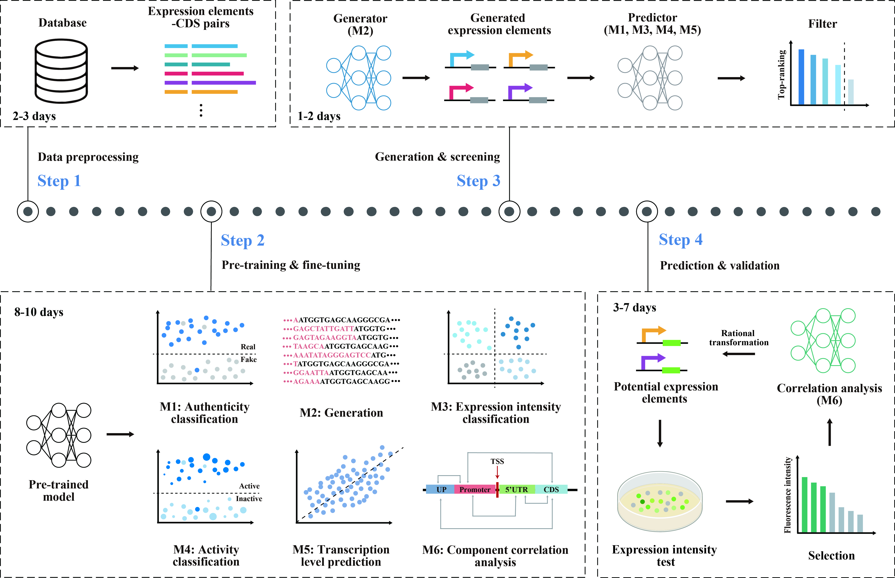

# BERT-PRISM: A Large-Scale Pretrained Model for Prokaryotic Expression Elements Recognition, Intensity, Synthesis, and Modulation
**We have published key code in this repo. The simplified version of the executable script to be released by March 20.**

BERT-PRISM is a pre-trained model specifically designed for prokaryotic promoters. Compared to other biological foundation models, it achieves comparable performance with significantly fewer parameters, making it highly adaptable for rapid customization to various specific downstream tasks. Furthermore, we have developed an integrated workflow based on this model to efficiently screen highly-expressive artificial promoter sequences and validate their performance by experiments.




## Setup
### Requirements
BERT-PRISM performed a secondary pre-training on [DNABERT-2](https://github.com/MAGICS-LAB/DNABERT_2). We use python=3.8 and pytorch==1.13.1 to conduct all our experiments. Make sure to install the correct [PyTorch](https://pytorch.org/) version on your system.


### Installation
We prefer you to create a [conda](https://www.anaconda.com/docs/getting-started/miniconda/main) environment to manage all packages.
```
conda create -n bertprism python=3.8
conda activate bertprism

<!-- conda install pytorch==1.13.1 torchvision==0.14.1 torchaudio==0.13.1 pytorch-cuda=11.7 -c pytorch -c nvidia -->
```
Next, install additional packages as instructed:
```
python3 -m pip install -r requirements.txt
<!-- conda install -c conda-forge ncbi-datasets-cli -->
```


## Model & dataset Downloads
All models and datasets for the project can be found at https://huggingface.co/datasets/Hongxuan-Wu/PED.


## Run
Check **config.py** to ensure all the filepaths is accurate.

Check the **batchsize** berfore you run any task.

Check '**config_file**' and '**log_dir**' in **main.py** before you run any task.

```
cd 1train/xxx
python main.py
```

## Contact
If you have any questions, please raise an issue or contact us at walter_hx@163.com.
